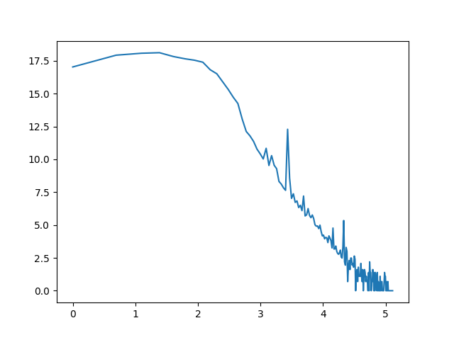
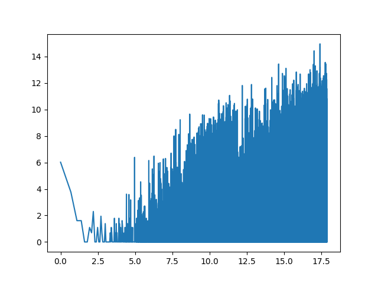

# Text corpus
based on Wikipedia EN Latest Articles -- enwiki-latest-pages-articles.xml.bz2
created with wiki.sh script

---

# Task 2 - advanced analysis

## Zipf law


## Zipf law for bigrams


*For this corpus bigrams Zipf law doest not apply*

## Words that disturb Zpifs law the most 

### Short words with low frequency
*These are mostly words from another languages and alphabets*
 - 1  - 'min': {'word': '𝜑', 'count': 1}
 - 2  - 'min': {'word': '𝘰𝘧', 'count': 1}
 - 3  - 'min': {'word': '𝘢𝘯𝘥', 'count': 1}
 - 4  - 'min': {'word': '𝔷𝔴𝔢𝔶', 'count': 1}
 - 5  - 'min': {'word': '𝔳𝔞𝔱𝔢𝔯', 'count': 1}
 - 6  - 'min': {'word': '𝕿𝖚𝖗𝖙𝖑𝖊', 'count': 1}
 - 7  - 'min': {'word': '𝘕𝘢𝘯𝘺𝘢𝘯𝘨', 'count': 1}
 - 8  - 'min': {'word': '𝘙𝘦𝘱𝘶𝘣𝘭𝘪𝘤', 'count': 1}
 - 9  - 'min': {'word': '𝔲𝔣𝔤𝔢𝔭𝔬𝔥𝔰𝔱', 'count': 1}
 - 10  - 'min': {'word': '𝔱𝔯𝔦𝔠𝔨𝔩𝔦𝔰𝔠𝔥', 'count': 1}
 - 11  - 'min': {'word': '𝔤𝔢𝔰𝔠𝔥𝔪𝔦𝔰𝔷𝔢𝔫', 'count': 1}
 - 12  - 'min': {'word': '𝔯𝔢𝔠𝔥𝔱𝔰𝔠𝔥𝔞𝔣𝔣𝔢', 'count': 1}


### Long words with high frequency
*Just weird words used multiple times*
 - 41  - 'max': {'word': 'ConductionsystemoftheheartwithouttheHeart', 'count': 8}
 - 42  -  'max': {'word': 'RightHumanPosteriorDistalRadiusUlnaCarpals', 'count': 6}
 - 43  - 'max': {'word': 'ayantheObituariesOfEminentMenByIbnKhallikan', 'count': 15}
 - 44  - 'max': {'word': 'MujahidinAnHistoricalWorkInTheArabicLanguage', 'count': 18}
 - 45  - 'max': {'word': 'Pneumonoultramicroscopicsilicovolcanoconiosis', 'count': 12}
 - 66  - 'max': {'word': 'SyrianGentlemanAndWarriorInThePeriodOfTheCrusadesMemoirsOfUsamaIbn', 'count': 3}
 - 67  - 'max': {'word': 'GayLiberationAndSocialismDocumentsFromTheDiscussionsOnGayLiberation', 'count': 3}
 - 70  - 'max': {'word': 'FieldMarshallVonMackensenAndCrownPrinceBorisReviewingBulgarianRegiment', 'count': 2}
 - 72  - 'max': {'word': 'ExploringSharedHistoryPreservingSharedHeritagePenangsLinksToASiamesePast', 'count': 2}
 - 76  - 'max': {'word': 'IsuPemilikanWilayahPantaiTimurSabahSatuPenelusurandaripadaSudutSumberSejarah', 'count': 2}
 - 79  - 'max': {'word': 'Donaudampfschiffahrtselektrizitätenhauptbetriebswerkbauunterbeamtengesellschaft', 'count': 2}
 - 88  - 'max': {'word': 'AhmadIbnMuhammadThalabiAraisAlMajalisFiQisasAlAnbiyaLivesOfTheProphetsLivesOfTheProphets', 'count': 2}
 - 94  - 'max': {'word': 'Llanshyfairshypwllshygwynshygyllshygogeryshychwyrnshydrobshywlllshylantyshysilioshygogoshygoch', 'count': 2}
 - 100  - 'max': {'word': 'Bababadalgharaghtakamminarronnkonnbronntonnerronntuonnthunntrovarrhounawnskawntoohoohoordenenthurnuk', 'count': 2}


## Custom metrics

### How complex were sentences - comas ~ dots ratio

22120137 / 24536140 ~= 0.9015328817

*This indicates, that less than 10% of sentences were highly complex*

### Words used in single paragraph - white spaces ~ new lines ratio

500903582 / 60208160 ~= 8.31952981124

*We can see, that on avarage a paragraph has barely over 8 words, which indicates that corpus has a lot of short and simple paragraphs*


## Code
Data for above analysis were gathered using *advanced.sh* script and processed using *advanced.py* script placed in analysis folder


---

# Task 1 - corpus extraction & preparation

# Code
 - include only article text in between <text> marks
 - exclude lines without alphabet letters 
 - clear excessive white spaces 
 - remove special characters
 - remove unintentional empty lines

# Stats
## No lines
```bash
$bzcat enwiki-latest-corpus.txt.bz2 | wc -l
677428585
```
## Size
### Unzipped
```bash
$du -sh bzcat enwiki-latest-corpus.txt
26G     enwiki-latest-corpus.txt
```
### Zipped
```bash
$du -sh enwiki-latest-corpus.txt.bz2
6.7G    enwiki-latest-corpus.txt.bz2
```
## Head of file
```bash
$bzcat enwiki-latest-corpus.txt.bz2 | head -n 5
REDIRECT Computer accessibility

short description Political philosophy and movement
Humans lived in society societies without formal hierarchies long before the establishment of formal states, realms, or empires. With the rise of organised hierarchical bodies, scepticism toward authority also rose. Although traces of anarchist thought are found throughout history, modern anarchism emerged from the Age of Enlightenment Enlightenment. During the latter half of the 19th and the first decades of the 20th century, the anarchist movement flourished in most parts of the world and had a significant role in workers struggles for emancipation. Various anarchist schools of thought formed during this period. Anarchists have taken part in several revolutions, most notably in the Paris Commune, the Russian Civil War and the Spanish Civil War, whose end marked the end of the classical era of anarchism. In the last decades of the 20th and into the 21st century, the anarchist movement has been resurgent once more, growing in popularity and influence within anti-capitalist, anti-war and anti-globalisation movements.
Anarchists employ a diversity of tactics in order to meet their ideal ends which can be broadly separated into revolutionary and evolutionary tactics; there is significant overlap between the two, which are merely descriptive. Revolutionary tactics aim to bring down authority and state, having taken a violent turn in the past, while evolutionary tactics aim to prefigure what an anarchist society would be like. Anarchist thought, criticism, and Praxis (process) praxis have played a part in diverse areas of human society.
```
## Random lines from file
```bash
$bzcat enwiki-latest-corpus.txt.bz2 | shuf -n 5
1 Oppose. Agree with Solipsist. I think a photo like what they show on the Cadbury ads would be great to illustrate chocolate. Melted chocolate with more melted chocolate being poured into it. --User:Fir0002 Fir0002 03:08, 24 Sep 2004 (UTC)
2 Category:Maritime incidents in 1915
3 Skagit Station Mount Vernon bus icon 12px Amtrak Thruway Motorcoach
4 In 1951, he was awarded an honorary Academy Award. He was never nominated for an Oscar in any competitive category.
photo3b   Vision Australia Transport Connections travel day June 2021 South Brisbane railway Grey Street South Brisbane L1170054.jpg!South Brisbane Railway Station
5 Ship name *Carolyn (1912-1941)
```